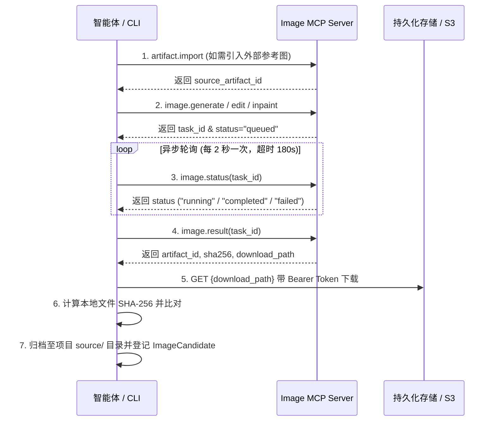

# VerdantFlare 图像生成标准工作流

本文档定义通过 VerdantFlare Image MCP 服务生产、轮询、校验并归档原子图像资产的完整标准流程。

---

## 1. 触发条件

- 用户明确要求生成人物四视图、服装无脸三视图、分镜画面（`F01`~`F08`）、场景概念图；
- 上层工作流（如 `verdantflare-music-mv`）在推进单元制作时调用图像生产能力；
- 需对既有素材执行局部重绘修脸、微调服装或擦除噪点。

---

## 2. 标准执行步骤

### 步骤一：参数解析与规格校验

1. 确定项目标识 `project_id`（形如 `<creator>/<project_id>`，例如 `creator/demo-project`），禁止使用 `default`；
2. 构造客户端唯一幂等键 `idempotency_key`（例如 `B01/identity-01-v1`）；
3. 引擎与模型选择：
   - 默认引擎：权威采用 `engine="codex"`（生图模型 `gpt-image-2`），提供极致商业质感与构图控制；
   - 备选引擎：若需快速概念迭代或多模态指令编辑，可显式指定 `engine="gemini"`（模型 `gemini-3.1-flash-image`）；
4. 读取 `references/visual-specs.md` 确认尺寸比例（`16:9` 或 `1:1`）与分辨率（`2k` 或 `4k`）。

### 步骤二：参考图导入（仅当有外部参考底图时）

1. 外部素材必须先通过 HTTPS 可信源获取；
2. 计算外部文件的 SHA-256；
3. 调用 `artifact.import(project_id, source_url, filename, expected_sha256)`；
4. 获得受控 `artifact_id` 后方可作为后续编辑或局部重绘的底图。

### 步骤三：发起异步任务

1. 文生图：调用 `image.generate(...)`；
2. 图生图：调用 `image.edit(...)`，传入 `source_artifact_id`；
3. 局部重绘：调用 `image.inpaint(...)`，传入 `source_artifact_id` 与 `mask_artifact_id`；
4. 记录返回的 `task_id`。

### 步骤四：轮询任务状态

1. 初始等待 3 秒；
2. 循环调用 `image.status(task_id)`：
   - 若状态为 `queued` 或 `running`，睡眠 2 秒后继续轮询；
   - 若状态为 `completed`，退出循环进入步骤五；
   - 若状态为 `failed`，读取 `error` 字段并向用户报告具体失败原因，中止流程；
   - 若轮询累计耗时超过 180 秒，触发超时保护，报告超时状态。

### 步骤五：获取结果与产物下载

1. 调用 `image.result(task_id)`，获取 `download_path`（形如 `/image/artifacts/<artifact_id>/content`）、`sha256`、`size_bytes`；
2. 向 `${IMAGE_MCP_URL}`（或网关端点）+ `download_path` 发送 HTTP GET 请求，携带 `Authorization: Bearer <IMAGE_MCP_BEARER_TOKEN>`；
3. 将二进制流保存到本地项目指定目录（如 `.output/projects/<project_id>/source/<subpath>`）。

### 步骤六：本地 SHA-256 完整性检验

1. 对本地刚保存的图片计算 SHA-256 哈希；
2. 将计算结果与步骤五返回的 `sha256` 进行强匹配校验；
3. 若不一致，立即删除本地文件并报错（可能发生传输截断或损坏）。

### 步骤七：归档与人工审核门

1. 将技术合格的文件正式命名并归档；
2. 输出包含生成耗时、模型名称、分辨率、不可变 SHA-256 的产物摘要；
3. 标记为 `ImageCandidate`，等待人类创作者进行艺术与风格审核。
