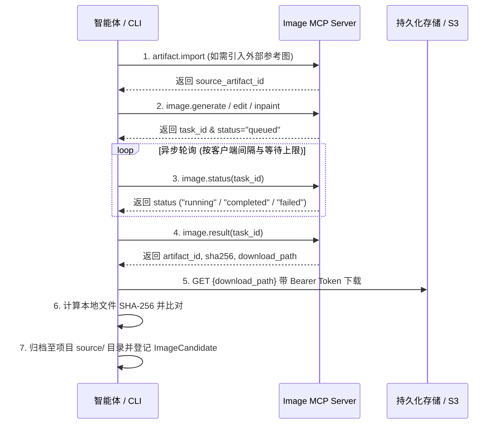

# VerdantFlare 图像生成标准工作流

本文档定义通过 VerdantFlare Image MCP 服务生产、轮询、校验并归档原子图像资产的完整标准流程。

---

## 1. 触发条件

- 用户明确要求生成人物四视图、服装无脸三视图、分镜画面（`F01`~`F08`）、场景概念图；
- 上层工作流（如 `verdantflare-music-mv`）在推进单元制作时调用图像生产能力；
- 需对既有素材执行局部重绘修脸、微调服装或擦除噪点。

---

## 2. Project / World 接入

开始调用前，先从当前 Studio 会话取得已打开的 `project_id`。它是服务生成的小写 UUIDv7；不得从本地目录、人物名称或 Prompt 拼出项目 ID，也不得把 `creator/demo-project` 这类旧示例当成生产值。

- 新生成、外部导入和编辑结果都先写入当前 Project。Artifact 返回的 `artifact_id`、版本、SHA-256 和任务 ID 由 Project 提交登记；本地下载只是工作副本。
- 输入来自 World 时，先调用 `world.get(asset_id, asset_version_id)`，核对授权并选择该版本中的具体文件。将解析出的 `ContentRef` 导入当前项目或作为 Image MCP 的参考；不传展示名、`latest`、临时 URL 或未解析的资产 ID。
- 通过 `project.commit` 明确写入文件、`selections`、`asset_refs` 和审核 MD。图像批准后若确实可复用，才由上层调用 `world.register` 创建 `character-image` 固定版本；Image Skill 不自动发布 World。
- 另一台电脑打开同一项目时从服务端恢复清单和入口文档。不要因为本地图片未下载而重新生成；先按清单读取或下载原 Artifact。

---

## 3. 标准执行步骤

```mermaid
sequenceDiagram
    participant Agent as 智能体 / CLI
    participant MCP as Image MCP Server
    participant Storage as 持久化存储 / S3

    Agent->>MCP: 1. artifact.import (如需引入外部参考图)
    MCP-->>Agent: 返回 source_artifact_id
    Agent->>MCP: 2. image.generate / edit / inpaint
    MCP-->>Agent: 返回 task_id & status="queued"

    loop 异步轮询 (按客户端间隔与等待上限)
        Agent->>MCP: 3. image.status(task_id)
        MCP-->>Agent: 返回 status ("running" / "completed" / "failed")
    end

    Agent->>MCP: 4. image.result(task_id)
    MCP-->>Agent: 返回 artifact_id, sha256, download_path

    Agent->>Storage: 5. GET {download_path} 带 Bearer Token 下载
    Agent->>Agent: 6. 计算本地文件 SHA-256 并比对
    Agent->>Agent: 7. 归档至项目 source/ 目录并登记 ImageCandidate
```

### 步骤一：参数解析与规格校验

1. 确定项目标识 `project_id`（来自当前 Studio Project 上下文的小写 UUIDv7），禁止使用 `default` 或路径别名；
2. 构造客户端唯一幂等键 `idempotency_key`（例如 `B01/identity-01-v1`）；
3. 引擎与模型选择：
   - 默认引擎：权威采用 `engine="codex"`（生图模型 `gpt-image-2.5-sunburst`，亦支持 `gpt-image-2.5-flare`），提供极致商业写真质感、真实毛孔细节与构图控制；
   - 备选引擎：若需快速概念迭代或多模态指令编辑，可显式指定 `engine="gemini"`（模型 `gemini-3.1-flash-image`）；
4. 按资产类型读取 [视觉规格](visual-specs.md)，并核对用户要求与宿主支持的实际尺寸。

### 步骤二：参考图导入（仅当有外部参考底图时）

1. 外部素材必须先通过 HTTPS 可信源获取；
2. 计算外部文件的 SHA-256；
3. 在当前 Project 上下文中调用 `artifact.import(project_id, source_url, filename, expected_sha256)`；
4. 获得受控 `artifact_id` 后方可作为后续编辑或局部重绘的底图。

### 步骤三：发起异步任务

1. 文生图：调用 `image.generate(...)`；
2. 图生图：调用 `image.edit(...)`，传入 `source_artifact_id`；
3. 局部重绘：调用 `image.inpaint(...)`，传入 `source_artifact_id` 与 `mask_artifact_id`；
4. 记录返回的 `task_id`。

### 步骤四：轮询任务状态

1. 使用客户端/宿主配置的轮询间隔；Image CLI 默认 2 秒、等待上限 180 秒，可用 `--timeout` 调整。
2. 循环调用 `image.status(task_id)`：
   - 若状态为 `queued` 或 `running`，按配置间隔继续轮询；
   - 若状态为 `completed`，退出循环进入步骤五；
   - 若状态为 `failed`，脱敏记录错误并排查；可恢复本地故障直接修复，重新生成须在授权预算内；
   - 达到本次等待上限时保存任务 ID 与最近状态；等待超时不等于任务失败，可继续查询原任务，不重新生成。

### 步骤五：获取结果与产物下载

1. 调用 `image.result(task_id)`，获取 `download_path`（形如 `/image/artifacts/<artifact_id>/content`）、`sha256`、`size_bytes`；
2. 向 `${IMAGE_MCP_URL}`（或网关端点）+ `download_path` 发送 HTTP GET 请求，携带 `Authorization: Bearer <IMAGE_MCP_BEARER_TOKEN>`；
3. 将二进制流保存到当前项目工作目录的相对路径（如 `source/<subpath>`），由 `project.commit` 登记；不要把本地绝对路径或存储 URL 写入共享清单。

### 步骤六：本地 SHA-256 完整性检验

1. 对本地刚保存的图片计算 SHA-256 哈希；
2. 将计算结果与步骤五返回的 `sha256` 进行强匹配校验；
3. 若不一致，隔离本次损坏下载，重取同一 Artifact 后复验；不覆盖已有正确文件，不重新生成。

### 步骤七：归档与人工审核门

1. 检查文件非空、可解码、实际尺寸符合批准规格，再将技术合格文件正式命名并归档；
2. 输出包含生成耗时、模型名称、分辨率、不可变 SHA-256 的产物摘要；
3. 标记为 `ImageCandidate`，等待人类创作者进行艺术与风格审核。
